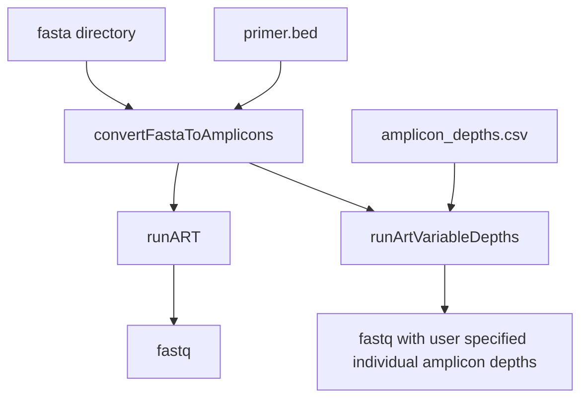

# Amplicone - Amplicon rEad simulator 

A Nextflow pipeline for running [ART](https://doi.org/10.1093/bioinformatics/btr708) with modifications to support amplicon read simulations with the option to have user supplied depths of each amplicon. 

#### Introduction

This pipeline uses [ART](https://doi.org/10.1093/bioinformatics/btr708) to generate simulated reads from an input fasta file. Given a fasta and primer bed file, ampliclone will generate amplicon-specific reads. Optionally, the user can provide a CSV file specifying individual amplicon depths. If not specified, amplicon reads will be generated in equal proportions based on the supplied depth parameter. 




#### Quick-start

```
nextflow run BCCDC-PHL/rsv-a-artic-nf -profile conda \
  --prefix "output_file_prefix" \
  --bed /path/to/primers.bed \
  --ref /path/to/ref.fa \
  --primer_pairs_tsv /path/to/primer_pairs_tsv \
  --composite_ref /path/to/human_and_rsv-a_composite_ref \
  --directory /path/to/reads \
  --outdir /path/to/outputs
```


#### Installation
An up-to-date version of Nextflow is required because the pipeline is written in DSL2. Following the instructions at https://www.nextflow.io/ to download and install Nextflow should get you a recent-enough version. 


#### Conda
The repo contains a environment.yml files which automatically build the correct conda env if `-profile conda` is specifed in the command. Although you'll need `conda` installed, this is probably the easiest way to run this pipeline.

--cache /some/dir can be specified to have a fixed, shared location to store the conda build for use by multiple runs of the workflow.

#### Config

Important config options are:

| Option                           | Default  | Description                                                                                                         |
|:---------------------------------|---------:|--------------------------------------------------------------------------------------------------------------------:|
| `normalizationTargetDepth`       | `200`    | Target depth of coverage to normalize to prior to alignment                                                         |
| `normalizationMinDepth`          | `5`      | Minimum depth of coverage to normalize to prior to alignment                                                        |
| `keepLen`                        | `50`     | Length of reads to keep after primer trimming                                                                       |
| `qualThreshold`                  | `20`     | Sliding window quality threshold for keeping reads after primer trimming                                            |
| `varMinFreqThreshold`            | `0.25`   | Allele frequency threshold for ambiguous variant                                                                    |
| `varFreqThreshold`               | `0.75`   | Allele frequency threshold for unambiguous variant                                                                  |
| `varMinDepth`                    | `10`     | Minimum coverage depth to call variant                                                                              |

### Depth Normalization
By default, sequence depth will be normalized using `bbnorm` to the value specified by the `--normalizationTargetDepth` param (default: 200). To skip depth normalization, add the `--skip_normalize_depth` flag.

#### QC
A script to do some basic QC is provided in `bin/qc.py`. It measures the % of reference bases are covered by `varMinDepth`, and the longest stretch of consensus sequence with no `N` bases. This script does not make a QC pass/fail call.

#### Output
A subdirectory for each process in the workflow is created in `--outdir`. A `nml_upload` subdirectory containing dehosted fastq files and consensus sequences is included. 


