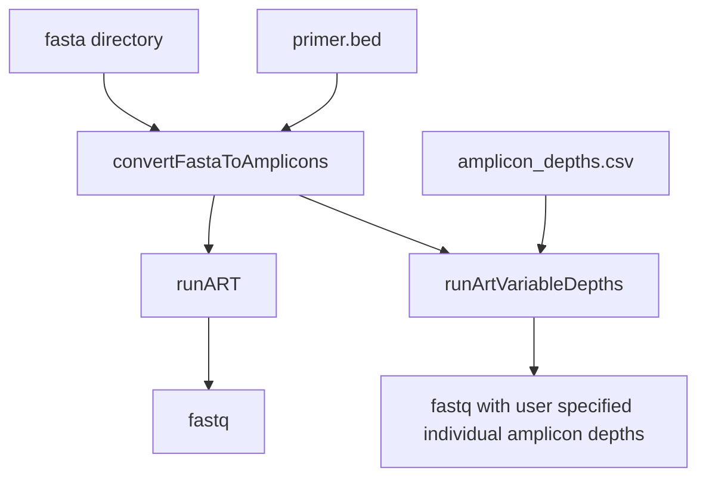

# Amplicone - Amplicon rEad simulator 

(IN DEVELOPMENT) 
A Nextflow pipeline for running  [ART](https://doi.org/10.1093/bioinformatics/btr708) with modifications to support amplicon read simulations with the option to have user supplied depths of each amplicon. 

