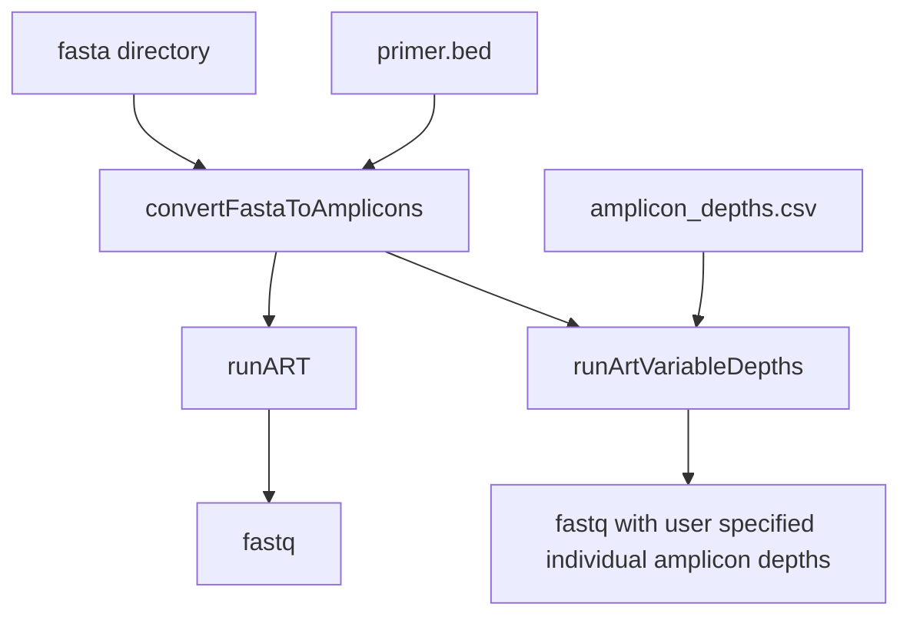

# Amplicone - Amplicon rEad simulator 

(IN DEVELOPMENT) Takes a reference fasta and primer bed file and generates simulated amplicon reads using [ART](https://doi.org/10.1093/bioinformatics/btr708). User can vary depth of individual amplicons. 

