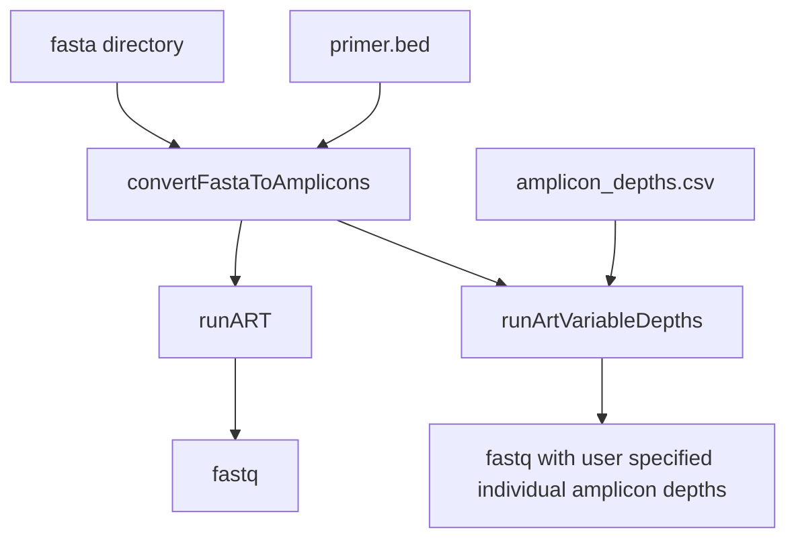

# Amplicone - Amplicon rEad simulator 

A Nextflow pipeline for running [ART](https://doi.org/10.1093/bioinformatics/btr708) with modifications to support amplicon read simulations with the option to have user supplied depths of each amplicon. 

#### Introduction

This pipeline uses [ART](https://doi.org/10.1093/bioinformatics/btr708) to generate simulated reads from an input fasta file. Given a fasta and primer bed file, the pipeline will generate amplicon-specific reads. Optionally, the user can provide a CSV file specifying individual amplicon depths. If not specified, amplicon reads will be generated in equal proportions based on the supplied depth parameter. 




#### Quick-start

```
nextflow run BCCDC-PHL/amplicone -profile conda \
  --bed /path/to/primers.bed \
  --fasta_dir /path/to/fasta_directory \
  --model_R1 /path/to/error_model_R1 \
  --model_R2 /path/to/error_model_R2 \
  --outdir /path/to/outputs 
```


#### Installation
An up-to-date version of Nextflow is required because the pipeline is written in DSL2. Follow the instructions at https://www.nextflow.io/ to download and install Nextflow.


#### Conda
The repo contains a environment.yml files which automatically build the correct conda env if `-profile conda` is specifed in the command. 

--cache /some/dir can be specified to have a fixed, shared location to store the conda build for use by multiple runs of the workflow.

#### Config

Important config options are:

| Option                           | Default  | Description                                                                                                         |
|:---------------------------------|---------:|--------------------------------------------------------------------------------------------------------------------:|
| `vary_amplicon_depths`       | `false`    | Set to true if user is supplying individual amplicon depths                                                         |
| `amplicon_depths`          | `NO_FILE`      | A CSV file containing "amplicon" and "depth" for each amplicon in primer.bed file                                                      |
| `depth`                        | `50`     | Desired depth for reads if not supplying individual amplicon depths                                                                       |
| `fragment_mean`                  | `600`     | Mean genomic fragment size                                            |
| `fragment_sd`            | `75`   | Standard deviation of genomic fragment size                                                                    |
| `read_length`               | `150`   | Simulated read length                                                                 |
| `model_R1`                    | `NO_FILE`     | Error profile of R1 reads                                                                              |
| `model_R2`                    | `NO_FILE`     | Error profile of R2 reads                                                                              |

#### Output
A subdirectory for each process in the workflow is created in `--outdir`. 


