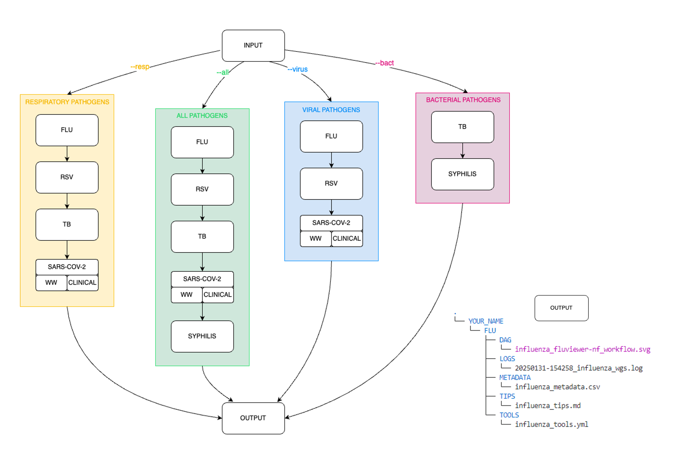

A Nextflow pipeline for providing public health bioinfo

#### Introduction

The bioinflow pipeline is a workflow that provides information on various pathogen genomics workflows utilized at the BCCDC-PHL. You can select specific pathogens of interest or collections of pathogens and it will return tools and tips curated for you.




#### Quick-start

```
nextflow run BCCDC-PHL/bioinflow \
  --input <input_file> \
  --name <your name>  \
  --all
```


#### Installation
An up-to-date version of Nextflow is required because the pipeline is written in DSL2. Follow the instructions at https://www.nextflow.io/ to download and install Nextflow.

#### Input

The input is a question file of format *.txt or *.md (either question.txt or question.md) in addition to the user's name. Which file format is used depends on the pathogen of interest. The workflows and corresponding input file format is specified below:

| Option       | Input Type | Workflow                                                                                                
|:--------------|------------:|:-----------------------------------------------------------------------------------------------------------|
| `--pathogen flu`       | *.txt |  Influenza only.                                                                          |
| `--pathogen rsv`        | *.md |  RSV only.                                                      | 
| `--pathogen tb`        | *.txt  |  TB only.                                                          |
| `--pathogen sarscov2_ww`       | *.md |  SARS-CoV-2 in wastewater only.                                                  |          
| `--pathogen sarscov2_clin`       | *.md  |  Clinical SARS-CoV-2 only.                                                         |
| `--pathogen tpa`        | *.txt  |  Treponema pallidum subsp. pallidum only.                                                     |  
| `--all`    |  *.txt or *.md |  Retrieve information about all pathogen analyses                                                  |             
| `--resp`      | *.txt or *.md  |  Retrieve information about respiratory pathogen analyses                                                                   
|`--virus`    |  *.txt or *.md |  Retrieve information about viral genomic analyses                                                    |
| `--bact`    |  *.txt or *.md |  Retrieve information about bacterial genomic analyses                                                    | 

#### Config

Important config options are:

| Option        | Requirement | Description                                                                                                | Microbe  |
|:--------------|------------:|:-----------------------------------------------------------------------------------------------------------|:---------|
| `input`       | `Mandatory` |  Absolute path to the input file.                                                                          |           |
| `name`        | `Mandatory` |  Name of user. Used for logging and output directory.                                                      |           |
| `all `        | `Optional`  |  Retrieve information about all pathogen analyses                                                          | flu, rsv, tb, sars-cov-2, treponema     |
| `resp `       | `Optional`  |  Retrieve information about respiratory pathogen analyses                                                  | flu, rsv, tb, sars-cov-2                |
| `virus`       | `Optional`  |  Retrieve information about viral genomic analyses                                                         | flu, rsv,  sars-cov-2                   |
| `bact`        | `Optional`  |  Retrieve information about bacterial genomic analyses                                                     | tb, treponema                          |
| `pathogen`    | `Optional`  |  Retrieve information about single pathogen of interest                                                    | pathogen of interest                   |
| `email`    | `Optional`  |  Enter your email to receive your results                                                 |                  |
| `question`    | `Optional`  |  Ask us a question. Ensure you use the --email param so we can get back to you                                                 |               |
| `fun`      | `Optional`  | Have a little fun                       |                           |
#### Output
A subdirectory for each process in the workflow is created in `--outdir`. 


